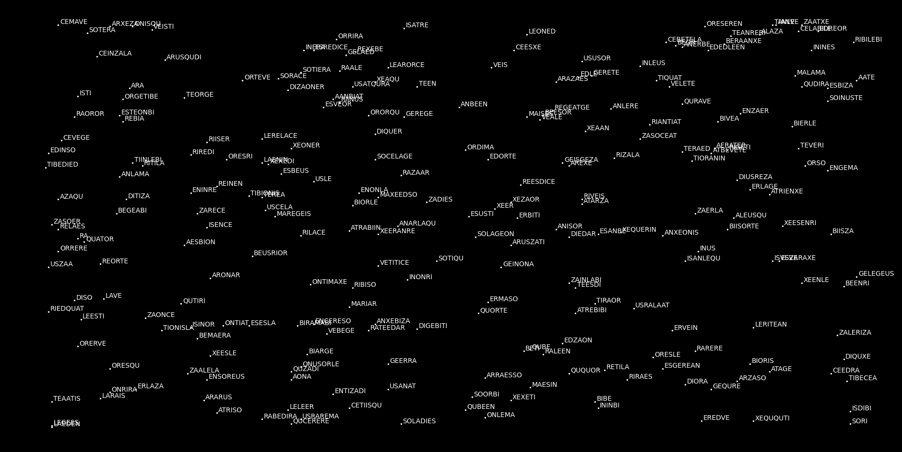
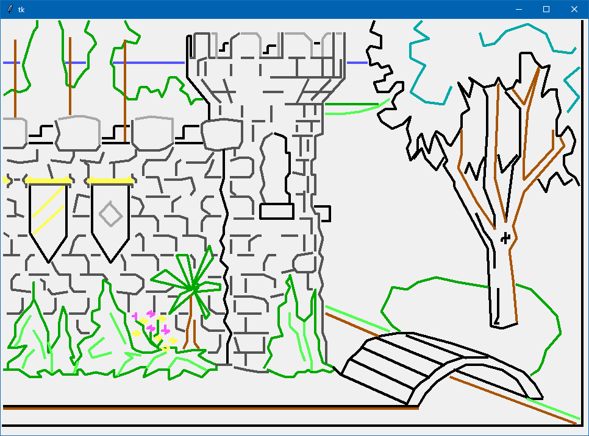

# Python for university
This repository is for my Python codes for various tasks in university.
So far, they are all tied to the subject **Python programming**.

The lectures and practices are made by [Peter Sovietov][true-grue]
and can be found at his [kispython][kp-rep] repository.
If you cannot access them there, I have a [fork][kp-fork] on my profile.

Information about specific tasks and practices can be found
in `.md` files in their folders.

---
## Tasks overview
Some of the tasks are trivial (it's a university course, after all),
but some are very interesting. Here are a few I encourage to look at:

### Galaxy generation (Practice 3 task 8)
The task is to picture the first galaxy from the game Elite (1984) with
Matplotlib. The galaxy is generated from a seed consisting of just
three numbers, which determine everything about the stars,
including the coordinates and names which we need.
The original game is written in C, so we need to replicate the
algorithm in Python and still get the same results.
There's a detailed explanation in the [readme][gg-readme] for
practice 3 folder, the [code][gg-code] is also there.

Also, here's how the result looks:

### Hash table (Practice 4 task 1)
This task is to implement a hash table data structure like Python's
built-in `dict`. I went a little beyond and made it pretty much
identical (by using operator overrides). A detailed explanation is in
the [readme][ht-readme] for practice 4 folder,
[code][ht-code] is also there.

### King's Quest graphics (Practice 4 task 8)
The task is to draw scenes from King's Quest using the original data
from the game and tkinter. The graphics there is essentially a set of
commands to draw lines in different ways.
Explanation in [readme][kq-readme], there's the [code][kq-code],
and here's an example:

### Mutation testing (Practice 5 task 4)
The task is to make a mutation testing module. Mutation testing
involves slightly altering the operations or structure in the code
(mutating the code), then running this altered code through unit tests.
A number of such mutants are made and tested. Mutants passing the tests
means the tests lack coverage of border cases and need more work.

The module code is [here][mt-code]. I do not have a detailed
explanation of it, but I made the comments in code as descriptive as I
could, so I encourage you to read it.

### Julia set (Practice 6 task 11)
This task is to picture the [Julia set][js-pb]
(also check the [wiki][js-wiki]).
There is a detailed explanation in the [readme][js-readme] for
practice 6, and you can check the [code][js-code] in that same folder.

Here is an animation with multiple generated frames showing
how the Julia set changes over a range of values of the `c` constant (check explanation in the readme):

### Other tasks
There are more interesting tasks there which I didn't showcase,
such as [graphdir.py][gd-code] or the last few robot tasks.
Thanks for your attention!

[true-grue]: https://github.com/true-grue
[kp-rep]: https://github.com/true-grue/kispython
[kp-fork]: https://github.com/Un57a6L3/kispython

[gg-readme]: ./practice3/README.md
[gg-code]: ./practice3/pr3-task08.py

[ht-readme]: ./practice4/README.md
[ht-code]: ./practice4/hash.py

[kq-readme]: ./practice4/README.md
[kq-code]: ./practice4/pr4-task8.py

[mt-code]: ./practice5/mut.py

[gd-code]: ./practice2/graphdir.py

[js-pb]: http://paulbourke.net/fractals/juliaset/
[js-wiki]: https://en.wikipedia.org/wiki/Julia_set
[js-readme]: ./practice6/README.md
[js-code]: ./practice6/pr6-task11.py