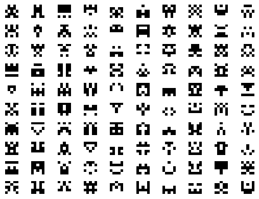
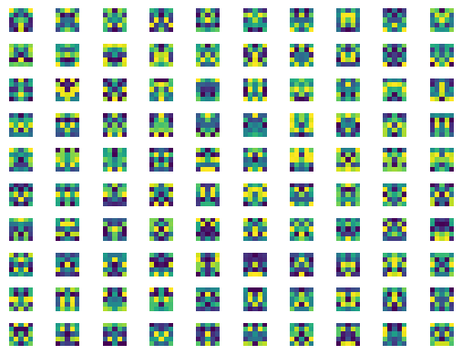

# Practice 3
This folder contains my codes for practice 3 tasks of subject *Python programming*.
The full practice document can be found
[here](https://github.com/true-grue/kispython).
Summary of the tasks (and answers) is as follows:

---
## Task 1 (theory)
> Write code examples that correspond to given PEP-8 violations.

Here's a table of examples for each violation:

| PEP-8                                                           |      Code       |
|-----------------------------------------------------------------|:---------------:|
| `whitespace before '('                                        ` |    `foo ()`     |
| `missing whitespace around operator                           ` |      `1>2`      |
| `missing whitespace after ','                                 ` |     `[1,2]`     |
| `unexpected spaces around keyword / parameter equals          ` | `foo(par = 5)`  |
| `multiple statements on one line (colon)                      ` | `if True: pass` |
| `multiple statements on one line (semicolon)                  ` | `foo(); bar()`  |
| `comparison to None should be 'if cond is None:'              ` | `if a == None:` |
| `comparison to True should be 'if cond is True:' or 'if cond:'` | `if a == True:` |

There's also a violation I could not put into the table due to how Markdown formatting works:
`expected 2 blank lines, found 1` - I think it's an obvious one.

Here's a four-line piece of code that has one of each violation:
```python
def foo (a =(1==True)):
    if a == None: bar(); return a,5

def bar(): pass
```

---
## Task 2 (theory)
> Do modules load once or with every import statement? Prove your answer with code.

Modules load once. The code listed below proves that -
for several import statements the module code is executed only once.
```python
# File test.py:
print('test.py loaded successfully')

# File main.py:
import test
import test
import test
```

Output: `test.py loaded successfully`.

---
## Task 3 (theory)
> Say, we want to change the value of a module's global variable for all users of the module.
What will the code below lead to? What can be done instead?
> ```python
> from some_module import GLOBAL_VAR
> GLOBAL_VAR = 42
> ```

In the case above, instead of changing the value, `GLOBAL_VAR` will be redeclared.
Here's what can be done instead:
```python
import some_module
some_module.GLOBAL_VAR = 42
```

---
## Task 4 (theory)
> Try to make import with `*` controlled from the module,
so it would lead to importing only a certain list of names in the module.

This can be done by using `__all__`.  It is a list of strings defining what symbols
in a module will be exported when `from <module> import *` is used on the module.
The following code in `test.py` explicitly exports the symbols `foo` and `boo`:
```python
__all__ = ['foo', 'boo']
foo = 5
bar = 10
def boo(): return 'boo'
```
These symbols can be imported like so:
```python
from test import *
print(foo)  # 5
print(boo)  # boo
print(bar)  # triggers an exception
```

---
## Task 6
> Write a `run_with_log(func)` function that adds exception info to a log-file.
The function is not supposed to handle exceptions. User function is passed as parameter.

You can find the code [here](pr3-task06.py).
It is not quite finished however, as it uses a try-except block, which is sort of against the task.
Better use of the `logging` library is the solution. Here's a log example generated by the code:
```
ERROR:root:log
Traceback (most recent call last):
  File "F:\coding-kispython\practice3\pr3-task06.py", line 12, in run_with_log
    func()
  File "F:\coding-kispython\practice3\pr3-task06.py", line 5, in foo
    a = 1 / 0
ZeroDivisionError: division by zero
```

---
## Task 7
> Implement procedural generation of 5x5 pixel sprites with Matplotlib and the `imshow` function.
Take advantage of symmetry.

You can find the code [here](pr3-task07.py).
Here's a couple examples of generated sprites:




---
## Task 8
> Picture the legendary first galaxy from the game Elite (1984) with Matplotlib.

You can find the code [here](pr3-task08.py).
Here's the generated image:


