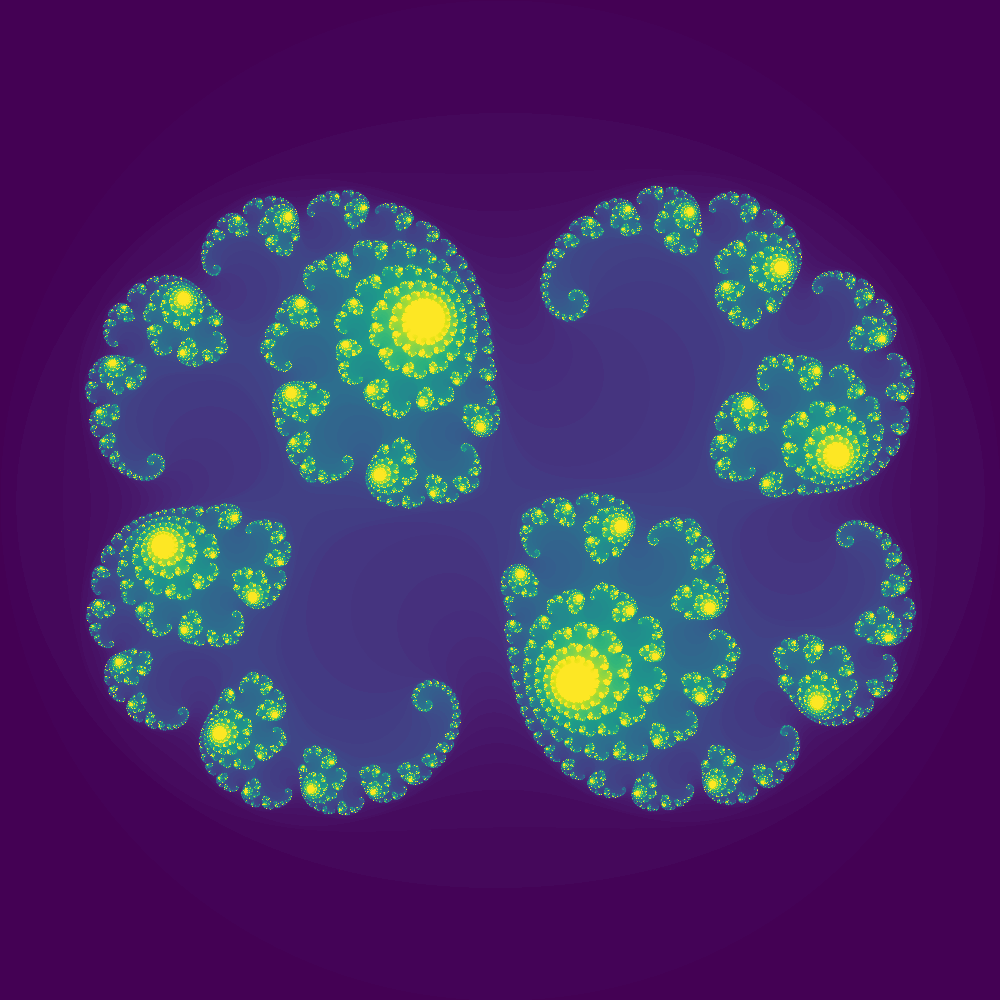
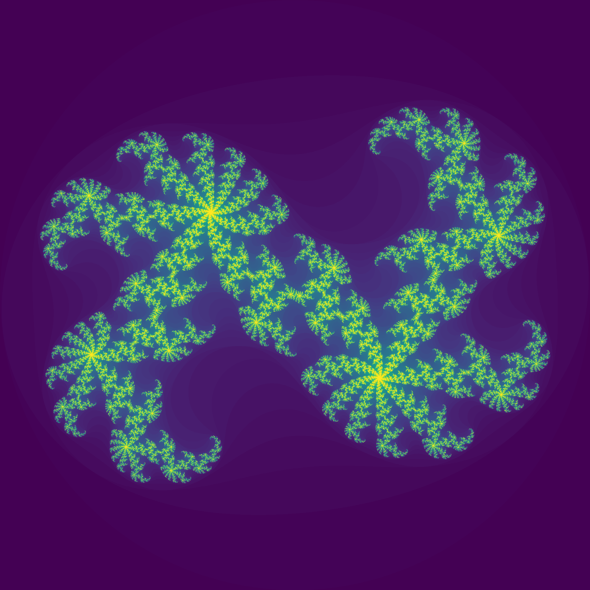

# Python Practice 6
This folder contains my codes for practice 5 tasks of subject *Python programming*.
The full practice document can be found [here][kp-rep].

---
## Task 11 (Julia set)

> Picture the [Julia set][julia-set].
> 1. Implement it in standard Python first.
> 2. Then write a NumPy version (with boolean indexing and a single loop).
> 3. Compare the performance of both versions.

### Description
First we need to understand what a Julia set is.
> The Julia set is now associated with those points `z = x + iy`
> on the complex plane for which the series `z[n+1] = z[n] ** 2 + c`
> does not tend to infinity. `c` is a complex constant,
> one gets a different Julia set for each c.
> The initial value `z0` for the series is each point in the image plane.

How do we compute that? To see if a series for a point tends to infinity,
we can set an 'escape' radius. If a point's value becomes greater
than this radius, then the point tends to infinity. If it doesn't escape
within a set number of iterations, it is then part of the Julia set.
For the points we can create a matrix and iterate over it.

So first we choose a value for `c`, based on that we calculate
the radius, which defines the range of values of the starting points:

```python
c = complex(cx, cy)  # our chosen value

# Radius must be such that r**2 - r >= sqrt(cx**2 + cy**2)
radius = 0
while radius ** 2 - radius < abs(c):
    radius += 0.1
```

Then we create a matrix and assign each element a complex value
within the radius based on the element index:

```python
plane = [[None] * n for _ in range(n)]
for y in range(n):
    for x in range(n):
        # Scaling to be between -R and R
        z = (2 * r / n) * complex(x, y) - complex(r, r)
```

Now for each value we can iterate before it 'escapes' or we reach
the maximum iteration limit. What we then put into the matrix is
the number of iterations the point took.
```python
iter = 0
while abs(z) < r and iter < max_iter:
    z = z ** 2 + c
    iter += 1
plane[y][x] = iter
```

Once we've done that, we can use `imsave` from `matplotlib.pyplot`
to plot and save the result as an image.
```python
norm = plt.Normalize(vmin=0, vmax=max_iter)
image = cmap(norm(plane))
plt.imsave(f"images/{name}.png", image)
```

That method of calculation sure works, but is inefficient.
I mean, it's a 3-deep nested loop! So, let's write a better version in NumPy.

We can use `numpy.mgrid` to quickly create and fill matrices.
After creating two matrices for both coordinates we can merge them
into one matrix with complex values. This time let's also create a
separate matrix for the iteration count.

```python
plane_y, plane_x = np.mgrid[r:-r:n*1j, -r:r:n*1j]
plane = plane_x + plane_y * 1j
iters = np.full(plane.shape, 0)
```

With NumPy we can create a mask, which is a boolean matrix with the
results of a condition for all the elements of a matrix.
We can also apply a function or lambda expression over a matrix.
Moreover, we can control what elements are affected by using
the mask we created. Let's create a single loop using these:

```python
f = lambda x: x ** 2 + c

for iter in range(max_iter):
    mask = abs(plane) < r
    plane[mask] = f(plane[mask])
    iters[mask] += 1
return iters
```

This version has far better performance than the standard Python one.
You can see examples of results in the [images folder][imgs].

<!--


-->

By generating a bunch of images for a range of `c` values we can make
an animation of how the set changes within the range:


[imgs]: ../images
[kp-rep]: https://github.com/true-grue/kispython
[julia-set]: http://paulbourke.net/fractals/juliaset/